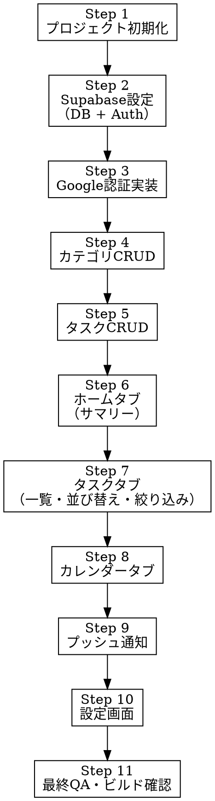
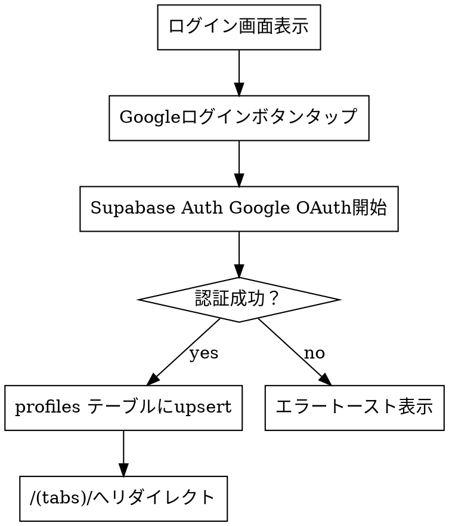

# SPEC.md — Todo管理アプリ（仮称: TaskBoard）

> **⚠️ Claude Codeへの絶対命令：この仕様書を1文字も飛ばさず、上から順番に実行せよ。要約・省略・先読みは禁止。各フェーズの完了条件を満たすまで次のフェーズに進むな。**

-----

## 0. プロジェクト概要

「開けば今日〜今後のタスクが一目でわかる」Todo管理iOSアプリ。
ShukatsuBoardのUI/UX設計思想を完全継承し、カテゴリ管理・プッシュ通知・Googleログインを備えた不特定多数向けアプリ。

**参照資料（必読）:** `HANDOFF-SHUKATSUBOARD-UI.md`（ShukatsuBoardの設計継承元）

-----

## 1. 技術スタック（変更禁止）

|項目       |技術                           |備考                |
|---------|-----------------------------|------------------|
|フレームワーク  |React Native (Expo SDK 51+)  |                  |
|ナビゲーション  |expo-router v3               |                  |
|状態管理     |Zustand + AsyncStorage       |useShallow必須（後述）  |
|認証       |Supabase Auth (Google OAuth2)|Expo AuthSession経由|
|データベース   |Supabase (PostgreSQL)        |                  |
|通知       |expo-notifications           |                  |
|アニメーション  |react-native-reanimated v3   |                  |
|ドラッグ&ドロップ|react-native-gesture-handler |                  |
|スタイリング   |NativeWind v4 (Tailwind)     |                  |

-----

## 2. 実装フロー（全体）



-----

## 3. データベース設計（Supabase）

### 3-1. テーブル定義

**`profiles`テーブル（Supabase Authと連携）**

```sql
create table profiles (
  id uuid references auth.users on delete cascade primary key,
  email text,
  created_at timestamp with time zone default now()
);
alter table profiles enable row level security;
create policy "Users can view own profile" on profiles
  for select using (auth.uid() = id);
```

**`categories`テーブル**

```sql
create table categories (
  id uuid default gen_random_uuid() primary key,
  user_id uuid references profiles(id) on delete cascade not null,
  name text not null,
  color text not null default '#007AFF',
  created_at timestamp with time zone default now()
);
alter table categories enable row level security;
create policy "Users can manage own categories" on categories
  for all using (auth.uid() = user_id);
```

**`todos`テーブル**

```sql
create table todos (
  id uuid default gen_random_uuid() primary key,
  user_id uuid references profiles(id) on delete cascade not null,
  title text not null,
  memo text default '',
  due_date timestamp with time zone,
  priority text check (priority in ('high', 'medium', 'low')) default 'medium',
  category_id uuid references categories(id) on delete set null,
  is_completed boolean default false,
  order_index integer default 0,
  notification_minutes_before integer,
  created_at timestamp with time zone default now(),
  updated_at timestamp with time zone default now()
);
alter table todos enable row level security;
create policy "Users can manage own todos" on todos
  for all using (auth.uid() = user_id);
```

### 3-2. schemaVersion管理

- Zustandストアに `schemaVersion: 1` を必ず含める
- 将来のマイグレーション用に persist の migrate 関数を初期から設定すること

-----

## 4. ディレクトリ構成（厳守）

```
app/
  (auth)/
    login.tsx          # ログイン画面
  (tabs)/
    index.tsx          # ホームタブ
    tasks.tsx          # タスクタブ
    calendar.tsx       # カレンダータブ
    _layout.tsx        # ボトムナビ定義
  _layout.tsx          # ルートレイアウト（認証ガード）
components/
  tasks/
    TaskCard.tsx       # タスクカード
    TaskDetailModal.tsx # タスク詳細モーダル
    AddTaskForm.tsx    # タスク追加フォーム
  home/
    SummaryCard.tsx    # サマリーカード
    CategoryProgress.tsx # カテゴリ別進捗
  calendar/
    MonthView.tsx      # 月表示
    WeekView.tsx       # 週表示
  common/
    BottomSheet.tsx    # 共通ボトムシート
    PriorityBadge.tsx  # 優先度バッジ
    CategoryPill.tsx   # カテゴリピル
lib/
  supabase.ts          # Supabaseクライアント
  notifications.ts     # 通知ヘルパー
store/
  useAppStore.ts       # Zustandストア
  types.ts             # 型定義
```

-----

## 5. 型定義（`store/types.ts`に記述）

```typescript
export type Priority = 'high' | 'medium' | 'low';

export interface Category {
  id: string;
  userId: string;
  name: string;
  color: string;
  createdAt: string;
}

export interface Todo {
  id: string;
  userId: string;
  title: string;
  memo: string;
  dueDate: string | null;        // ISO datetime文字列 or null
  priority: Priority;
  categoryId: string | null;
  isCompleted: boolean;
  orderIndex: number;
  notificationMinutesBefore: number | null;
  createdAt: string;
  updatedAt: string;
}

export interface AppState {
  todos: Todo[];
  categories: Category[];
  schemaVersion: number;
  // actions
  addTodo: (todo: Omit<Todo, 'id' | 'userId' | 'createdAt' | 'updatedAt'>) => void;
  updateTodo: (id: string, updates: Partial<Todo>) => void;
  deleteTodo: (id: string) => void;
  addCategory: (category: Omit<Category, 'id' | 'userId' | 'createdAt'>) => void;
  updateCategory: (id: string, updates: Partial<Category>) => void;
  deleteCategory: (id: string) => void;
  loadFromSupabase: () => Promise<void>;
  syncToSupabase: (todo: Todo) => Promise<void>;
}
```

-----

## 6. Zustandストア設計（`store/useAppStore.ts`）

### ⚠️ 絶対ルール：React 19無限ループ回避

```typescript
// ❌ 絶対禁止：オブジェクトを直接セレクトする
const todos = useAppStore((s) => s.todos); // 無限ループ発生

// ✅ 必須：useShallowを使う
import { useShallow } from 'zustand/react/shallow';
const todos = useAppStore(useShallow((s) => s.todos));

// ✅ 単一プリミティブは直接OK
const schemaVersion = useAppStore((s) => s.schemaVersion);
```

### Persist設定

```typescript
persist(
  (set, get) => ({ ... }),
  {
    name: 'taskboard-data',
    storage: createJSONStorage(() => AsyncStorage),
    version: 1,
    migrate: (persistedState: any, version: number) => {
      // v1: 初期バージョン、マイグレーション不要
      return persistedState;
    },
  }
)
```

-----

## 7. デザイントークン（ShukatsuBoard完全継承）

### カラーパレット

```typescript
export const colors = {
  light: {
    primary: '#007AFF',
    primaryBg: '#E8F0FE',
    pageBg: '#F2F2F7',
    cardBg: '#FFFFFF',
    text: '#1C1C1E',
    secondaryText: '#8E8E93',
    border: '#E5E5EA',
    danger: '#FF3B30',
    success: '#34C759',
    warning: '#FF9500',
  },
  dark: {
    primary: '#0A84FF',
    primaryBg: '#1a2744',
    pageBg: '#09090b',
    cardBg: '#18181b',
    text: '#f4f4f5',
    secondaryText: '#71717a',
    border: '#27272a',
    danger: '#FF453A',
    success: '#30D158',
    warning: '#FF9F0A',
  },
};
```

### 優先度カラー

```typescript
export const priorityColors = {
  high:   { bg: 'rgba(255,59,48,0.1)',   text: '#FF3B30' },
  medium: { bg: 'rgba(255,149,0,0.1)',   text: '#FF9500' },
  low:    { bg: 'rgba(52,199,89,0.1)',   text: '#34C759' },
};
```

### スペーシング・角丸

```typescript
export const radius = { card: 16, button: 12, input: 14, pill: 999 };
export const spacing = { xs: 4, sm: 8, md: 16, lg: 24 };
```

-----

## 8. 画面仕様

### 8-1. ログイン画面（`app/(auth)/login.tsx`）



**UI要件:**

- アプリ名・ロゴ（中央配置）
- 「Googleでログイン」ボタン（プライマリブルー）
- ダーク/ライトモード対応

-----

### 8-2. ホームタブ（`app/(tabs)/index.tsx`）

**表示内容（サマリーカード形式）:**

|カード    |表示内容             |色            |
|-------|-----------------|-------------|
|今日締切   |件数               |#FF3B30（赤）   |
|今週締切   |件数               |#FF9500（オレンジ）|
|期限超過   |件数               |#FF453A（赤強調） |
|完了進捗   |完了数／全件数 + プログレスバー|#34C759（緑）   |
|カテゴリ別進捗|各カテゴリの完了率バー      |カテゴリ色        |

**セクション定義:**

- 「今日」= due_date が今日（00:00〜23:59）
- 「今週」= due_date が明日〜今週末
- 「期限超過」= due_date < now() かつ is_completed = false

-----

### 8-3. タスクタブ（`app/(tabs)/tasks.tsx`）

#### セクション構成

```
「今日」セクション     → due_date = 今日
「今週」セクション     → due_date = 今週（今日以外）
「今月」セクション     → due_date = 今月（今週以外）
「それ以降」セクション → due_date > 今月末
「未設定」セクション   → due_date = null
「完了済み」セクション → is_completed = true
```

#### 並び替え（4種類、切り替えボタンで選択）

|モード  |ロジック                                         |
|-----|---------------------------------------------|
|期限日時順|due_date ASC（nullは末尾）                        |
|手動   |order_index ASC + ドラッグ&ドロップ                  |
|優先度順 |high → medium → low                          |
|複合   |priority ASC → due_date ASC → order_index ASC|

#### 絞り込み（フィルターチップ）

- 「未完了」「完了済み」「すべて」
- カテゴリ別（ユーザー作成カテゴリ一覧をチップ表示）

#### ドラッグ&ドロップ（手動モードのみ有効）

```typescript
// react-native-gesture-handler + react-native-reanimated
// activationConstraint: { distance: 8 } で誤タップ防止
// ドロップ時に order_index を再計算してSupabaseに同期
```

-----

### 8-4. タスクカード（`components/tasks/TaskCard.tsx`）

**ShukatsuBoardのTaskCard設計を継承:**

```
┌─┬──────────────────────────────────┐
│ │ タスク名 (15px semibold)          │
│C│ 締切日時 (13px) [期限超過→赤]     │
│ │ [優先度バッジ] [カテゴリピル]      │
└─┴──────────────────────────────────┘
C = カテゴリカラーストリップ（6px幅）
```

**タップ挙動:**

- カード全体タップ → TaskDetailModal を開く
- タップフィードバック: `scale: 0.98`（react-native-reanimated）

-----

### 8-5. タスク詳細モーダル（`components/tasks/TaskDetailModal.tsx`）

**構造（ShukatsuBoardのCompanyDetailModal継承）:**

```
ヘッダー（固定）
├── グラブバー
├── タスク名入力欄（編集可能）
├── 優先度セレクター（高・中・低ピル）
└── 閉じるボタン

タブナビゲーション（3タブ）
├── [基本情報] 締切日時ピッカー / カテゴリ選択 / メモ欄
├── [通知]     通知タイミング入力（〇〇分前/時間前/日前）
└── [詳細]     作成日時 / 更新日時

フッター（固定）
├── 保存ボタン（プライマリブルー）
└── 削除ボタン（赤テキスト）→ 確認ダイアログ
```

**アニメーション:**

- 下からスライドアップ（react-native-reanimated y: 24→0, duration: 350ms）
- モバイル: rounded-t-2xl
- オーバーレイ: rgba(0,0,0,0.5)

-----

### 8-6. カレンダータブ（`app/(tabs)/calendar.tsx`）

**表示モード切り替え（ヘッダーに切り替えボタン）:**

- 月表示: グリッド型、各日にタスクのドット表示（カテゴリ色）
- 週表示: 縦型タイムライン、タスクをブロックで表示

**タスクタップ → TaskDetailModal を開く**

-----

### 8-7. 設定画面（モーダルまたは別タブ）

**セクション構成:**

1. **カテゴリ管理** — 追加・編集・削除（色選択付き）
1. **テーマ** — ライト / ダーク / システム
1. **アカウント** — ログアウトボタン

-----

## 9. 通知実装（`lib/notifications.ts`）

```typescript
import * as Notifications from 'expo-notifications';
import { parseISO, subMinutes, isValid } from 'date-fns';

export async function scheduleTaskNotification(
  todoId: string,
  title: string,
  dueDate: string,
  minutesBefore: number
): Promise<string | null> {
  const due = parseISO(dueDate);
  if (!isValid(due)) return null;

  const triggerDate = subMinutes(due, minutesBefore);
  if (triggerDate <= new Date()) return null;

  const identifier = await Notifications.scheduleNotificationAsync({
    content: {
      title: '⏰ タスクリマインダー',
      body: title,
      data: { todoId },
    },
    trigger: { date: triggerDate },
  });

  return identifier;
}

export async function cancelTaskNotification(identifier: string) {
  await Notifications.cancelScheduledNotificationAsync(identifier);
}
```

**⚠️ 注意事項:**

- 通知スケジュール時は必ず `isValid()` でバリデーション後に実行
- 過去の日時には通知をスケジュールしない（上記コード参照）
- タスク編集時は旧通知をキャンセルしてから再スケジュール

-----

## 10. date-fns 使用ルール（必須）

```typescript
import { format, parseISO, isValid, subMinutes, startOfDay, endOfDay, startOfWeek, endOfWeek, startOfMonth, endOfMonth } from 'date-fns';
import { ja } from 'date-fns/locale';

// ✅ 正しい使い方
const date = parseISO(todo.dueDate);
if (isValid(date)) {
  const formatted = format(date, 'M/d(E)', { locale: ja }); // → "3/15(土)"
}

// ❌ 禁止：isValid確認なしにformatを呼ぶ
const formatted = format(parseISO(todo.dueDate), 'M/d'); // クラッシュの原因
```

**セクション判定ロジック:**

```typescript
const now = new Date();
const todayStart = startOfDay(now);
const todayEnd = endOfDay(now);
const weekEnd = endOfWeek(now, { weekStartsOn: 1 });
const monthEnd = endOfMonth(now);

const getSection = (dueDate: string | null): string => {
  if (!dueDate) return 'unset';
  const date = parseISO(dueDate);
  if (!isValid(date)) return 'unset';
  if (date < now) return 'overdue';
  if (date <= todayEnd) return 'today';
  if (date <= weekEnd) return 'thisWeek';
  if (date <= monthEnd) return 'thisMonth';
  return 'later';
};
```

-----

## 11. Supabase リアルタイム同期方針

- **基本方針:** ローカルのZustandストアを正とし、操作ごとにSupabaseへ非同期sync
- **初回ロード:** アプリ起動時に `loadFromSupabase()` でSupabaseから全件取得してストアに格納
- **書き込み:** addTodo/updateTodo/deleteTodo 実行時に楽観的更新（ローカルを先に更新）→ バックグラウンドでSupabase同期
- **エラー時:** トースト通知でエラー表示、ローカル状態はそのまま保持（次回起動時に再同期）

-----

## 12. Red Flags（禁止事項）

以下の実装は**絶対に行ってはならない:**

```
❌ Zustandセレクターでオブジェクト/配列を useShallow なしで直接取得
❌ parseISO の結果を isValid() 確認なしに format() に渡す
❌ 通知を過去の日時にスケジュール
❌ Row Level Security (RLS) を無効にしたままデプロイ
❌ Supabase の API キーをコードにハードコード（必ず .env に記述）
❌ AsyncStorage への保存を同期的に扱う（必ず await）
❌ react-native-gesture-handler の Provider をルートに設置し忘れ
❌ expo-notifications の権限リクエストを通知スケジュール前に省略
```

-----

## 13. 環境変数（`.env.local`）

```
EXPO_PUBLIC_SUPABASE_URL=your_supabase_url
EXPO_PUBLIC_SUPABASE_ANON_KEY=your_supabase_anon_key
```

**⚠️ `EXPO_PUBLIC_` プレフィックスがないとクライアントから参照できない。**

-----

## 14. 各フェーズの完了条件

### Phase 1（認証・基盤）完了条件

- [ ] Googleログイン → ホームタブに遷移できる
- [ ] ログアウトでログイン画面に戻る
- [ ] Supabase の profiles テーブルにユーザーが作成される

### Phase 2（カテゴリ）完了条件

- [ ] カテゴリの作成・編集・削除ができる
- [ ] カテゴリに色を設定できる
- [ ] Supabase に保存・取得できる

### Phase 3（タスクCRUD）完了条件

- [ ] タスクの作成・編集・削除ができる
- [ ] タスク詳細モーダルが正しく動作する（3タブ）
- [ ] 完了チェックで「完了済み」セクションに移動する
- [ ] Supabase に保存・取得できる

### Phase 4（ホーム・タスクタブ）完了条件

- [ ] ホームタブにサマリーカードが正しく表示される
- [ ] タスクタブのセクション分けが正しく動作する
- [ ] 並び替え4種類が動作する
- [ ] 絞り込みが動作する
- [ ] ドラッグ&ドロップで手動並び替えができる

### Phase 5（カレンダー）完了条件

- [ ] 月表示・週表示が切り替えられる
- [ ] タスクがカレンダー上に表示される
- [ ] タップでTaskDetailModalが開く

### Phase 6（通知）完了条件

- [ ] 通知権限をリクエストできる
- [ ] タスクに通知タイミングを設定できる
- [ ] 指定時刻にプッシュ通知が届く（実機確認必須）
- [ ] タスク削除時に通知がキャンセルされる

-----

## 15. 実機テスト必須項目

以下はシミュレーターでは確認不可。**実機（iOS）で必ず確認:**

- [ ] プッシュ通知の受信
- [ ] Google OAuth認証フロー
- [ ] Safe Area（ノッチ・ホームインジケーター）の表示
- [ ] ダークモードの切り替え
